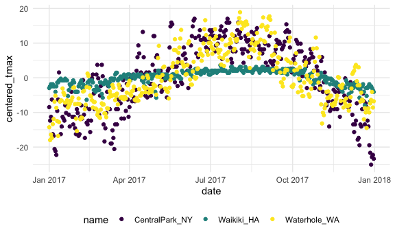

Exploratory data analysis
================

``` r
library(tidyverse)
```

    ## ── Attaching packages ───────────────────────────────────────────────────────────────────── tidyverse 1.3.0 ──

    ## ✓ ggplot2 3.3.2     ✓ purrr   0.3.4
    ## ✓ tibble  3.0.3     ✓ dplyr   1.0.2
    ## ✓ tidyr   1.1.2     ✓ stringr 1.4.0
    ## ✓ readr   1.3.1     ✓ forcats 0.5.0

    ## ── Conflicts ──────────────────────────────────────────────────────────────────────── tidyverse_conflicts() ──
    ## x dplyr::filter() masks stats::filter()
    ## x dplyr::lag()    masks stats::lag()

``` r
knitr::opts_chunk$set(
  fig.width = 6,
  fig.asp = .6,
  out.width = "90%"
)

theme_set(theme_minimal() + theme(legend.position = "bottom"))

options(
  ggplot2.continuous.colour = "viridis",
  ggplot2.continuous.fill = "viridis"
)

scale_colour_discrete = scale_colour_viridis_d
scale_fill_discrete = scale_fill_viridis_d
```

## Load the weather data

``` r
weather_df = 
  rnoaa::meteo_pull_monitors(
    c("USW00094728", "USC00519397", "USS0023B17S"),
    var = c("PRCP", "TMIN", "TMAX"), 
    date_min = "2017-01-01",
    date_max = "2017-12-31") %>%
  mutate(
    name = recode(
      id, 
      USW00094728 = "CentralPark_NY", 
      USC00519397 = "Waikiki_HA",
      USS0023B17S = "Waterhole_WA"),
    tmin = tmin / 10,
    tmax = tmax / 10,
    month = lubridate::floor_date(date, unit = "month")) %>%
  # round the date to the first day of the month
  select(name, id, everything())
```

    ## Registered S3 method overwritten by 'hoardr':
    ##   method           from
    ##   print.cache_info httr

    ## using cached file: /Users/wangyuqi/Library/Caches/R/noaa_ghcnd/USW00094728.dly

    ## date created (size, mb): 2020-10-05 10:31:49 (7.522)

    ## file min/max dates: 1869-01-01 / 2020-10-31

    ## using cached file: /Users/wangyuqi/Library/Caches/R/noaa_ghcnd/USC00519397.dly

    ## date created (size, mb): 2020-10-05 10:31:54 (1.699)

    ## file min/max dates: 1965-01-01 / 2020-03-31

    ## using cached file: /Users/wangyuqi/Library/Caches/R/noaa_ghcnd/USS0023B17S.dly

    ## date created (size, mb): 2020-10-05 10:31:56 (0.88)

    ## file min/max dates: 1999-09-01 / 2020-10-31

``` r
weather_df
```

    ## # A tibble: 1,095 x 7
    ##    name           id          date        prcp  tmax  tmin month     
    ##    <chr>          <chr>       <date>     <dbl> <dbl> <dbl> <date>    
    ##  1 CentralPark_NY USW00094728 2017-01-01     0   8.9   4.4 2017-01-01
    ##  2 CentralPark_NY USW00094728 2017-01-02    53   5     2.8 2017-01-01
    ##  3 CentralPark_NY USW00094728 2017-01-03   147   6.1   3.9 2017-01-01
    ##  4 CentralPark_NY USW00094728 2017-01-04     0  11.1   1.1 2017-01-01
    ##  5 CentralPark_NY USW00094728 2017-01-05     0   1.1  -2.7 2017-01-01
    ##  6 CentralPark_NY USW00094728 2017-01-06    13   0.6  -3.8 2017-01-01
    ##  7 CentralPark_NY USW00094728 2017-01-07    81  -3.2  -6.6 2017-01-01
    ##  8 CentralPark_NY USW00094728 2017-01-08     0  -3.8  -8.8 2017-01-01
    ##  9 CentralPark_NY USW00094728 2017-01-09     0  -4.9  -9.9 2017-01-01
    ## 10 CentralPark_NY USW00094728 2017-01-10     0   7.8  -6   2017-01-01
    ## # … with 1,085 more rows

## `group_by`

``` r
weather_df %>% 
  group_by(name, month)
```

    ## # A tibble: 1,095 x 7
    ## # Groups:   name, month [36]
    ##    name           id          date        prcp  tmax  tmin month     
    ##    <chr>          <chr>       <date>     <dbl> <dbl> <dbl> <date>    
    ##  1 CentralPark_NY USW00094728 2017-01-01     0   8.9   4.4 2017-01-01
    ##  2 CentralPark_NY USW00094728 2017-01-02    53   5     2.8 2017-01-01
    ##  3 CentralPark_NY USW00094728 2017-01-03   147   6.1   3.9 2017-01-01
    ##  4 CentralPark_NY USW00094728 2017-01-04     0  11.1   1.1 2017-01-01
    ##  5 CentralPark_NY USW00094728 2017-01-05     0   1.1  -2.7 2017-01-01
    ##  6 CentralPark_NY USW00094728 2017-01-06    13   0.6  -3.8 2017-01-01
    ##  7 CentralPark_NY USW00094728 2017-01-07    81  -3.2  -6.6 2017-01-01
    ##  8 CentralPark_NY USW00094728 2017-01-08     0  -3.8  -8.8 2017-01-01
    ##  9 CentralPark_NY USW00094728 2017-01-09     0  -4.9  -9.9 2017-01-01
    ## 10 CentralPark_NY USW00094728 2017-01-10     0   7.8  -6   2017-01-01
    ## # … with 1,085 more rows

``` r
  # ungroup() # get rid of all grouping
```

## counting things

count month/name observations

``` r
weather_df %>% 
  group_by(name, month) %>% 
  summarize(n_obs = n())
```

    ## `summarise()` regrouping output by 'name' (override with `.groups` argument)

    ## # A tibble: 36 x 3
    ## # Groups:   name [3]
    ##    name           month      n_obs
    ##    <chr>          <date>     <int>
    ##  1 CentralPark_NY 2017-01-01    31
    ##  2 CentralPark_NY 2017-02-01    28
    ##  3 CentralPark_NY 2017-03-01    31
    ##  4 CentralPark_NY 2017-04-01    30
    ##  5 CentralPark_NY 2017-05-01    31
    ##  6 CentralPark_NY 2017-06-01    30
    ##  7 CentralPark_NY 2017-07-01    31
    ##  8 CentralPark_NY 2017-08-01    31
    ##  9 CentralPark_NY 2017-09-01    30
    ## 10 CentralPark_NY 2017-10-01    31
    ## # … with 26 more rows

``` r
#n_obs is the variable I created, and n() is the function to count
```

we can use `count()` as well

``` r
weather_df %>% 
  count(month, name, name = "n_obs")
```

    ## # A tibble: 36 x 3
    ##    month      name           n_obs
    ##    <date>     <chr>          <int>
    ##  1 2017-01-01 CentralPark_NY    31
    ##  2 2017-01-01 Waikiki_HA        31
    ##  3 2017-01-01 Waterhole_WA      31
    ##  4 2017-02-01 CentralPark_NY    28
    ##  5 2017-02-01 Waikiki_HA        28
    ##  6 2017-02-01 Waterhole_WA      28
    ##  7 2017-03-01 CentralPark_NY    31
    ##  8 2017-03-01 Waikiki_HA        31
    ##  9 2017-03-01 Waterhole_WA      31
    ## 10 2017-04-01 CentralPark_NY    30
    ## # … with 26 more rows

*never* use base R’s `table`

``` r
weather_df %>% 
  pull(month) %>% 
  table()
# the result is not a dataframe; difficult to see
```

Other helpful counters

``` r
weather_df %>% 
  group_by(name, month) %>% 
  summarize(
    n_obs = n(),
    n_days = n_distinct(date)
    )
```

    ## `summarise()` regrouping output by 'name' (override with `.groups` argument)

    ## # A tibble: 36 x 4
    ## # Groups:   name [3]
    ##    name           month      n_obs n_days
    ##    <chr>          <date>     <int>  <int>
    ##  1 CentralPark_NY 2017-01-01    31     31
    ##  2 CentralPark_NY 2017-02-01    28     28
    ##  3 CentralPark_NY 2017-03-01    31     31
    ##  4 CentralPark_NY 2017-04-01    30     30
    ##  5 CentralPark_NY 2017-05-01    31     31
    ##  6 CentralPark_NY 2017-06-01    30     30
    ##  7 CentralPark_NY 2017-07-01    31     31
    ##  8 CentralPark_NY 2017-08-01    31     31
    ##  9 CentralPark_NY 2017-09-01    30     30
    ## 10 CentralPark_NY 2017-10-01    31     31
    ## # … with 26 more rows

``` r
# n_distinct(): all of the days in this month, how many days are distinct?
```

### A digression on 2x2 tables

``` r
weather_df %>% 
  filter(name != "Waikiki_HA") %>% 
  mutate(
    cold = case_when(
      tmax < 5 ~ "cold",
      tmax >= 5 ~ "not_cold",
      TRUE      ~ ""
      # the TRUE statement means if there is any missing data, code it as ""
    )
  ) %>% 
  group_by(name, cold) %>% 
  summarize(count = n())
```

    ## `summarise()` regrouping output by 'name' (override with `.groups` argument)

    ## # A tibble: 4 x 3
    ## # Groups:   name [2]
    ##   name           cold     count
    ##   <chr>          <chr>    <int>
    ## 1 CentralPark_NY cold        44
    ## 2 CentralPark_NY not_cold   321
    ## 3 Waterhole_WA   cold       172
    ## 4 Waterhole_WA   not_cold   193

``` r
weather_df %>% 
  filter(name != "Waikiki_HA") %>% 
  mutate(
    cold = case_when(
      tmax < 5 ~ "cold",
      tmax >= 5 ~ "not_cold",
      TRUE      ~ ""
    )) %>% 
  janitor::tabyl(name, cold)
```

    ##            name cold not_cold
    ##  CentralPark_NY   44      321
    ##    Waterhole_WA  172      193

## General summaries

You can do lots of summaries

``` r
weather_df %>% 
  group_by(month) %>% 
  summarize(
    mean_tmax = mean(tmax, na.rm = TRUE),
    mean_prcp = mean(prcp, na.rm = TRUE),
    median_tmin = median(tmin, na.rm = TRUE),
  )
```

    ## `summarise()` ungrouping output (override with `.groups` argument)

    ## # A tibble: 12 x 4
    ##    month      mean_tmax mean_prcp median_tmin
    ##    <date>         <dbl>     <dbl>       <dbl>
    ##  1 2017-01-01      10.8     37.0          1.7
    ##  2 2017-02-01      12.2     57.9          1.7
    ##  3 2017-03-01      13.0     54.6          1.1
    ##  4 2017-04-01      17.3     32.9          8.9
    ##  5 2017-05-01      19.9     28.4         11.7
    ##  6 2017-06-01      23.5     18.7         18.9
    ##  7 2017-07-01      25.5     12.7         20.8
    ##  8 2017-08-01      26.3     10.2         20  
    ##  9 2017-09-01      23.8      9.94        16.1
    ## 10 2017-10-01      20.1     41.5         12.8
    ## 11 2017-11-01      14.0     61.5          3.9
    ## 12 2017-12-01      11.0     40.2          1.6

This is a datafram\! so we can make a plot.

``` r
weather_df %>% 
  group_by(name, month) %>% 
  summarize(
    mean_tmax = mean(tmax, na.rm = TRUE),
    mean_prcp = mean(prcp, na.rm = TRUE),
    median_tmin = median(tmin, na.rm = TRUE)
  ) %>% 
  ggplot(aes(x = month, y = mean_tmax, color = name)) +
  geom_point() +
  geom_line() +
  theme(legend.position = "bottom")
```

Suppose you want to summarize many columns in the same way.

``` r
weather_df %>% 
  group_by(name, month) %>% 
  summarize(across(prcp:tmin, mean))
```

    ## `summarise()` regrouping output by 'name' (override with `.groups` argument)

    ## # A tibble: 36 x 5
    ## # Groups:   name [3]
    ##    name           month       prcp  tmax   tmin
    ##    <chr>          <date>     <dbl> <dbl>  <dbl>
    ##  1 CentralPark_NY 2017-01-01  39.5  5.98  0.748
    ##  2 CentralPark_NY 2017-02-01  22.5  9.28  1.45 
    ##  3 CentralPark_NY 2017-03-01  43.0  8.22 -0.177
    ##  4 CentralPark_NY 2017-04-01  32.5 18.3   9.66 
    ##  5 CentralPark_NY 2017-05-01  52.3 20.1  12.2  
    ##  6 CentralPark_NY 2017-06-01  40.4 26.3  18.2  
    ##  7 CentralPark_NY 2017-07-01  34.3 28.7  21.0  
    ##  8 CentralPark_NY 2017-08-01  27.4 27.2  19.5  
    ##  9 CentralPark_NY 2017-09-01  17.0 25.4  17.4  
    ## 10 CentralPark_NY 2017-10-01  34.3 21.8  13.9  
    ## # … with 26 more rows

reminder: sometimes your results are easier to read in another format.

``` r
weather_df %>% 
  group_by(name, month) %>% 
  summarize(mean_tmax = mean(tmax)) %>% 
  pivot_wider(
    names_from = name,
    values_from = mean_tmax
  ) %>% 
  knitr::kable(digits = 3)
```

    ## `summarise()` regrouping output by 'name' (override with `.groups` argument)

| month      | CentralPark\_NY | Waikiki\_HA | Waterhole\_WA |
| :--------- | --------------: | ----------: | ------------: |
| 2017-01-01 |           5.977 |      27.758 |       \-1.400 |
| 2017-02-01 |           9.282 |      27.218 |       \-0.018 |
| 2017-03-01 |           8.223 |      29.077 |         1.674 |
| 2017-04-01 |          18.273 |      29.713 |         3.873 |
| 2017-05-01 |          20.090 |          NA |        10.097 |
| 2017-06-01 |          26.263 |      31.310 |        12.873 |
| 2017-07-01 |          28.739 |          NA |        16.326 |
| 2017-08-01 |          27.194 |      32.016 |        19.645 |
| 2017-09-01 |          25.433 |      31.743 |        14.160 |
| 2017-10-01 |          21.787 |      30.287 |         8.313 |
| 2017-11-01 |          12.290 |      28.383 |         1.380 |
| 2017-12-01 |           4.474 |      26.461 |         2.213 |

## `group_by` and `mutate`

``` r
weather_df %>% 
  group_by(name) %>% 
  mutate(
    mean_tmax = mean(tmax, na.rm = TRUE),
    centered_tmax = tmax - mean_tmax
  ) %>% 
  ggplot(aes(x = date, y = centered_tmax, color = name)) +
  geom_point()
```

    ## Warning: Removed 3 rows containing missing values (geom_point).



``` r
# when do mutate, we will define a new variable according to each group first
```

what about window functions?

``` r
weather_df %>% 
  group_by(name, month) %>% 
  mutate(temp_rank = min_rank(tmax)) %>% 
  filter(temp_rank == 1)
```

    ## # A tibble: 42 x 8
    ## # Groups:   name, month [36]
    ##    name           id          date        prcp  tmax  tmin month      temp_rank
    ##    <chr>          <chr>       <date>     <dbl> <dbl> <dbl> <date>         <int>
    ##  1 CentralPark_NY USW00094728 2017-01-09     0  -4.9  -9.9 2017-01-01         1
    ##  2 CentralPark_NY USW00094728 2017-02-10     0   0    -7.1 2017-02-01         1
    ##  3 CentralPark_NY USW00094728 2017-03-15     0  -3.2  -6.6 2017-03-01         1
    ##  4 CentralPark_NY USW00094728 2017-04-01     0   8.9   2.8 2017-04-01         1
    ##  5 CentralPark_NY USW00094728 2017-05-13   409  11.7   7.2 2017-05-01         1
    ##  6 CentralPark_NY USW00094728 2017-06-06    15  14.4  11.1 2017-06-01         1
    ##  7 CentralPark_NY USW00094728 2017-07-25     0  21.7  16.7 2017-07-01         1
    ##  8 CentralPark_NY USW00094728 2017-08-29    74  20    16.1 2017-08-01         1
    ##  9 CentralPark_NY USW00094728 2017-09-30     0  18.9  12.2 2017-09-01         1
    ## 10 CentralPark_NY USW00094728 2017-10-31     0  13.9   7.2 2017-10-01         1
    ## # … with 32 more rows

``` r
# min_rank ranks from the lowest to the highest
```

``` r
weather_df %>% 
  group_by(name, month) %>% 
  mutate(temp_rank = min_rank(desc(tmax)))
```

    ## # A tibble: 1,095 x 8
    ## # Groups:   name, month [36]
    ##    name           id          date        prcp  tmax  tmin month      temp_rank
    ##    <chr>          <chr>       <date>     <dbl> <dbl> <dbl> <date>         <int>
    ##  1 CentralPark_NY USW00094728 2017-01-01     0   8.9   4.4 2017-01-01         9
    ##  2 CentralPark_NY USW00094728 2017-01-02    53   5     2.8 2017-01-01        19
    ##  3 CentralPark_NY USW00094728 2017-01-03   147   6.1   3.9 2017-01-01        14
    ##  4 CentralPark_NY USW00094728 2017-01-04     0  11.1   1.1 2017-01-01         4
    ##  5 CentralPark_NY USW00094728 2017-01-05     0   1.1  -2.7 2017-01-01        25
    ##  6 CentralPark_NY USW00094728 2017-01-06    13   0.6  -3.8 2017-01-01        28
    ##  7 CentralPark_NY USW00094728 2017-01-07    81  -3.2  -6.6 2017-01-01        29
    ##  8 CentralPark_NY USW00094728 2017-01-08     0  -3.8  -8.8 2017-01-01        30
    ##  9 CentralPark_NY USW00094728 2017-01-09     0  -4.9  -9.9 2017-01-01        31
    ## 10 CentralPark_NY USW00094728 2017-01-10     0   7.8  -6   2017-01-01        11
    ## # … with 1,085 more rows

``` r
# in this way, we rank from the highest to the lowest
```

lag

``` r
weather_df %>% 
  group_by(name) %>% 
  mutate(temp_change = tmax - lag(tmax,5)) %>% 
  summarize(
    temp_change_max = max(temp_change, na.rm = TRUE),
    temp_change_sd = sd(temp_change, na.rm = TRUE)
  )
```

    ## `summarise()` ungrouping output (override with `.groups` argument)

    ## # A tibble: 3 x 3
    ##   name           temp_change_max temp_change_sd
    ##   <chr>                    <dbl>          <dbl>
    ## 1 CentralPark_NY            22.1           7.05
    ## 2 Waikiki_HA                 6.7           1.50
    ## 3 Waterhole_WA              14.8           5.42

``` r
#generate a data that contains tomorrow's temperature
```
