visualization
================

``` r
library(tidyverse)
```

    ## ── Attaching packages ───────────────────────────────────────────────────────────────────── tidyverse 1.3.0 ──

    ## ✓ ggplot2 3.3.2     ✓ purrr   0.3.4
    ## ✓ tibble  3.0.3     ✓ dplyr   1.0.2
    ## ✓ tidyr   1.1.2     ✓ stringr 1.4.0
    ## ✓ readr   1.3.1     ✓ forcats 0.5.0

    ## ── Conflicts ──────────────────────────────────────────────────────────────────────── tidyverse_conflicts() ──
    ## x dplyr::filter() masks stats::filter()
    ## x dplyr::lag()    masks stats::lag()

``` r
library(ggridges)
#library(hexbin)
## hexbin is needed for running geom_hex()
```

## Load the weather data

``` r
weather_df = 
  rnoaa::meteo_pull_monitors(
    c("USW00094728", "USC00519397", "USS0023B17S"),
    var = c("PRCP", "TMIN", "TMAX"), 
    date_min = "2017-01-01",
    date_max = "2017-12-31") %>%
  mutate(
    name = recode(
      id, 
      USW00094728 = "CentralPark_NY", 
      USC00519397 = "Waikiki_HA",
      USS0023B17S = "Waterhole_WA"),
    tmin = tmin / 10,
    tmax = tmax / 10) %>%
  select(name, id, everything())
```

    ## Registered S3 method overwritten by 'hoardr':
    ##   method           from
    ##   print.cache_info httr

    ## using cached file: /Users/wangyuqi/Library/Caches/R/noaa_ghcnd/USW00094728.dly

    ## date created (size, mb): 2020-10-05 10:31:49 (7.522)

    ## file min/max dates: 1869-01-01 / 2020-10-31

    ## using cached file: /Users/wangyuqi/Library/Caches/R/noaa_ghcnd/USC00519397.dly

    ## date created (size, mb): 2020-10-05 10:31:54 (1.699)

    ## file min/max dates: 1965-01-01 / 2020-03-31

    ## using cached file: /Users/wangyuqi/Library/Caches/R/noaa_ghcnd/USS0023B17S.dly

    ## date created (size, mb): 2020-10-05 10:31:56 (0.88)

    ## file min/max dates: 1999-09-01 / 2020-10-31

``` r
weather_df
```

    ## # A tibble: 1,095 x 6
    ##    name           id          date        prcp  tmax  tmin
    ##    <chr>          <chr>       <date>     <dbl> <dbl> <dbl>
    ##  1 CentralPark_NY USW00094728 2017-01-01     0   8.9   4.4
    ##  2 CentralPark_NY USW00094728 2017-01-02    53   5     2.8
    ##  3 CentralPark_NY USW00094728 2017-01-03   147   6.1   3.9
    ##  4 CentralPark_NY USW00094728 2017-01-04     0  11.1   1.1
    ##  5 CentralPark_NY USW00094728 2017-01-05     0   1.1  -2.7
    ##  6 CentralPark_NY USW00094728 2017-01-06    13   0.6  -3.8
    ##  7 CentralPark_NY USW00094728 2017-01-07    81  -3.2  -6.6
    ##  8 CentralPark_NY USW00094728 2017-01-08     0  -3.8  -8.8
    ##  9 CentralPark_NY USW00094728 2017-01-09     0  -4.9  -9.9
    ## 10 CentralPark_NY USW00094728 2017-01-10     0   7.8  -6  
    ## # … with 1,085 more rows

## Scatterplots

create the first scatterplot\!

``` r
ggplot(weather_df, aes(x = tmin, y = tmax)) + 
  geom_point()
```

    ## Warning: Removed 15 rows containing missing values (geom_point).

<!-- -->

new approach, same plot.

``` r
weather_df %>% 
  ## we can do filter, select here
  ggplot(aes(x = tmin, y = tmax)) + 
  geom_point()
```

    ## Warning: Removed 15 rows containing missing values (geom_point).

<!-- -->

save and edit a plot object

``` r
weather_plot = 
  weather_df %>% 
  ggplot(aes(x = tmin, y = tmax))

weather_plot
```

<!-- -->

``` r
## save a plot into some object and print it later
```

## Advanced scatterplot

start with the same one and make it fancy\!

``` r
weather_df %>% 
  ggplot(aes(x = tmin, y = tmax, color = name)) + 
  geom_point() +
  geom_smooth(se = FALSE)
```

    ## `geom_smooth()` using method = 'loess' and formula 'y ~ x'

    ## Warning: Removed 15 rows containing non-finite values (stat_smooth).

    ## Warning: Removed 15 rows containing missing values (geom_point).

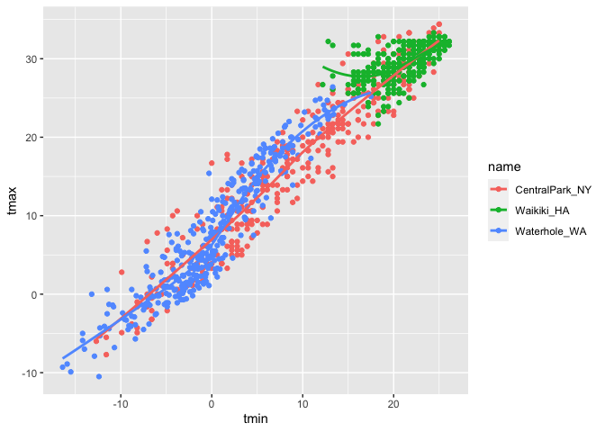<!-- -->

``` r
## remove the shadow of se
```

waht about the `aes` placement?

``` r
weather_df %>% 
  ggplot(aes(x = tmin, y = tmax)) + 
  geom_point(aes(color = name)) +
  geom_smooth()
```

    ## `geom_smooth()` using method = 'gam' and formula 'y ~ s(x, bs = "cs")'

    ## Warning: Removed 15 rows containing non-finite values (stat_smooth).

    ## Warning: Removed 15 rows containing missing values (geom_point).

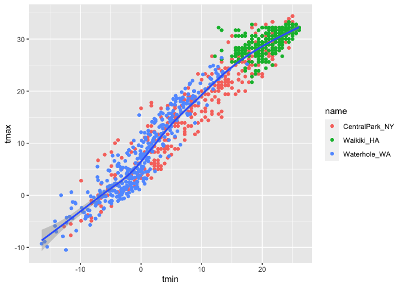<!-- -->

``` r
## we only get one blue line across the plot. the reason is that the color statement is within the first geom_point statement, but it will not influence the second one.
```

Let’s facet some things\!

``` r
weather_df %>% 
  ggplot(aes(x = tmin, y = tmax, color = name)) + 
  geom_point() +
  geom_smooth(se = FALSE) +
  facet_grid(. ~ name)
```

    ## `geom_smooth()` using method = 'loess' and formula 'y ~ x'

    ## Warning: Removed 15 rows containing non-finite values (stat_smooth).

    ## Warning: Removed 15 rows containing missing values (geom_point).

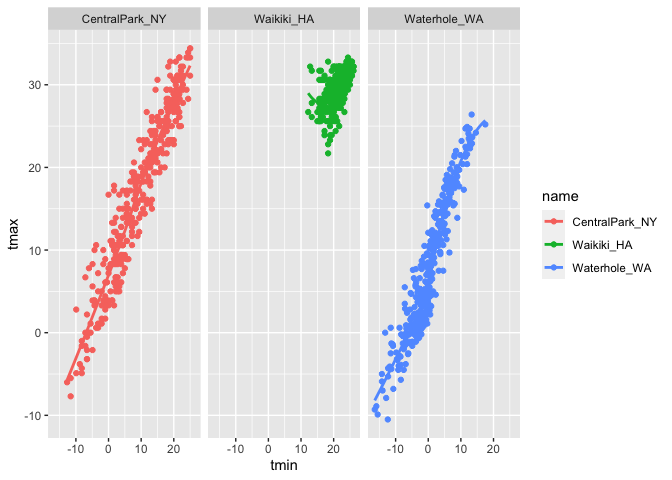<!-- -->

``` r
## "." means don't create rows, "~ name" means use name to create columns

weather_df %>% 
  ggplot(aes(x = tmin, y = tmax, color = name)) + 
  geom_point() +
  geom_smooth(se = FALSE) +
  facet_grid(name ~ .)
```

    ## `geom_smooth()` using method = 'loess' and formula 'y ~ x'

    ## Warning: Removed 15 rows containing non-finite values (stat_smooth).
    
    ## Warning: Removed 15 rows containing missing values (geom_point).

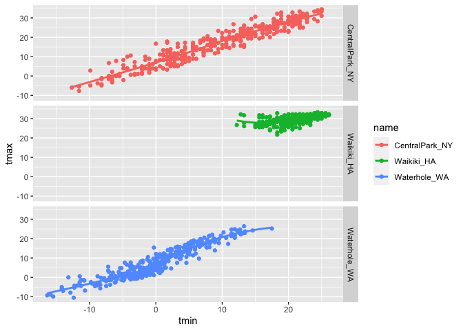<!-- -->

``` r
weather_df %>% 
  ggplot(aes(x = tmin, y = tmax, color = name)) + 
  geom_point(alpha = .2, size = .2) +
  geom_smooth(se = FALSE, size = 2) +
  facet_grid(. ~ name)
```

    ## `geom_smooth()` using method = 'loess' and formula 'y ~ x'

    ## Warning: Removed 15 rows containing non-finite values (stat_smooth).
    
    ## Warning: Removed 15 rows containing missing values (geom_point).

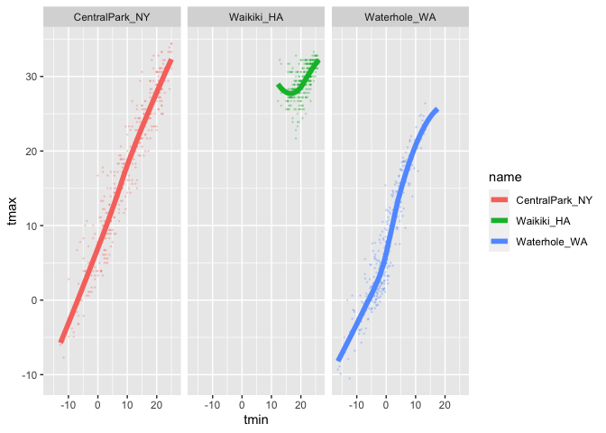<!-- -->

``` r
## alpha = .5 means 50% transparency


weather_df %>% 
  ggplot(aes(x = tmin, y = tmax, alpha = tmin, color = name)) + 
  geom_point() +
  geom_smooth(se = FALSE, size = 2) +
  facet_grid(. ~ name)
```

    ## `geom_smooth()` using method = 'loess' and formula 'y ~ x'

    ## Warning: Removed 15 rows containing non-finite values (stat_smooth).
    
    ## Warning: Removed 15 rows containing missing values (geom_point).

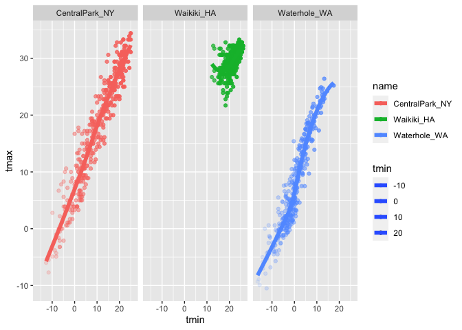<!-- -->

``` r
## alpha could equal to a variable
```

Let’s combine some elements and try a new plot

``` r
weather_df %>% 
  ggplot(aes(x = date, y = tmax, color = name)) +
  geom_point(aes(size = prcp), alpha = 0.5) +
  geom_smooth(se = FALSE) +
  facet_grid(. ~ name)
```

    ## `geom_smooth()` using method = 'loess' and formula 'y ~ x'

    ## Warning: Removed 3 rows containing non-finite values (stat_smooth).

    ## Warning: Removed 3 rows containing missing values (geom_point).

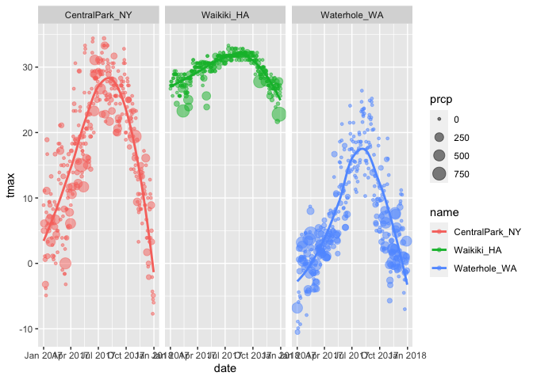<!-- -->

## small notes

How many geoms have to exist?

You can have whatever geoms you want.

``` r
weather_df %>% 
  ggplot(aes(x = tmin, y = tmax, color = name)) +
  geom_smooth(se = FALSE)
```

    ## `geom_smooth()` using method = 'loess' and formula 'y ~ x'

    ## Warning: Removed 15 rows containing non-finite values (stat_smooth).

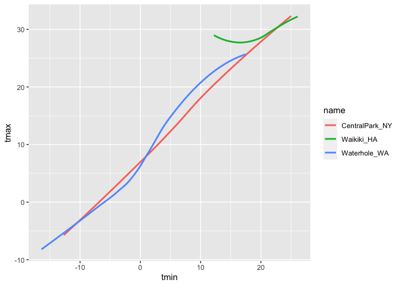<!-- -->

You can use a neat geom\!

``` r
weather_df %>% 
  ggplot(aes(x = tmin, y = tmax))
```

<!-- -->

``` r
  #geom_hex()
  #geom_bin2d()
  #geom_density2d()
```

## univariate plots

Histogram\!

``` r
weather_df %>% 
  ggplot(aes(x = tmin)) +
  geom_histogram()
```

    ## `stat_bin()` using `bins = 30`. Pick better value with `binwidth`.

    ## Warning: Removed 15 rows containing non-finite values (stat_bin).

<!-- -->

can we add color?

``` r
weather_df %>% 
  ggplot(aes(x = tmin, color = name)) +
  geom_histogram(position = "dodge")
```

    ## `stat_bin()` using `bins = 30`. Pick better value with `binwidth`.

    ## Warning: Removed 15 rows containing non-finite values (stat_bin).

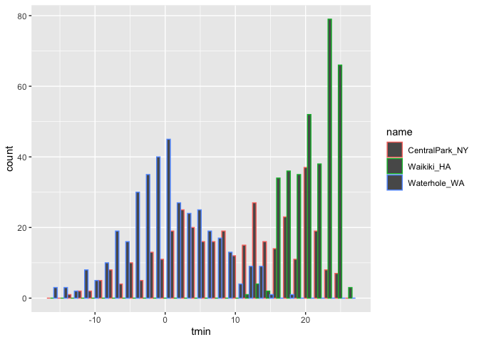<!-- -->

``` r
# dodge is used to make the bars not overlapped with each other

weather_df %>% 
  ggplot(aes(x = tmin, fill = name)) +
  geom_histogram(position = "dodge")
```

    ## `stat_bin()` using `bins = 30`. Pick better value with `binwidth`.

    ## Warning: Removed 15 rows containing non-finite values (stat_bin).

<!-- -->

``` r
weather_df %>% 
  ggplot(aes(x = tmin, fill = name)) +
  geom_histogram() +
  facet_grid(. ~ name)
```

    ## `stat_bin()` using `bins = 30`. Pick better value with `binwidth`.

    ## Warning: Removed 15 rows containing non-finite values (stat_bin).

<!-- -->

a new geometry\!

``` r
weather_df %>% 
  ggplot(aes(x = tmin, fill = name)) +
  geom_density(alpha = .4, adjust = .5)
```

    ## Warning: Removed 15 rows containing non-finite values (stat_density).

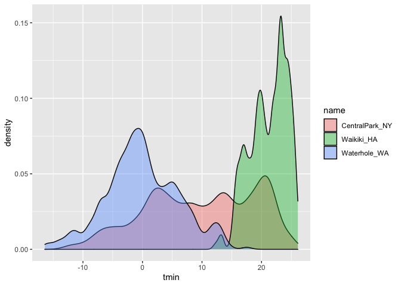<!-- -->

``` r
# density is used to smooth the data, but we lose some information, but easy to compare
# adjust means to show more details, like binwidth in histogram
```

what about box plot?

``` r
weather_df %>% 
  ggplot(aes(x = name, y = tmin)) +
  geom_boxplot()
```

    ## Warning: Removed 15 rows containing non-finite values (stat_boxplot).

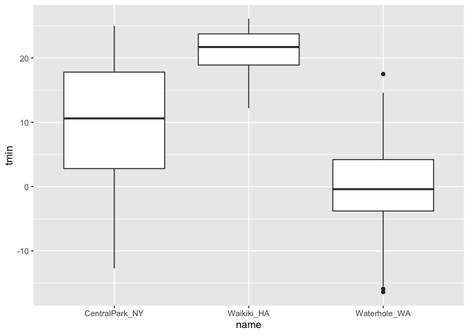<!-- -->

Trendy plots

``` r
weather_df %>% 
  ggplot(aes(x = name, y = tmin, fill = name)) +
  geom_violin(alpha = .5) +
#more intuitive than boxplots
  stat_summary(fun = "median")
```

    ## Warning: Removed 15 rows containing non-finite values (stat_ydensity).

    ## Warning: Removed 15 rows containing non-finite values (stat_summary).

    ## Warning: Removed 3 rows containing missing values (geom_segment).

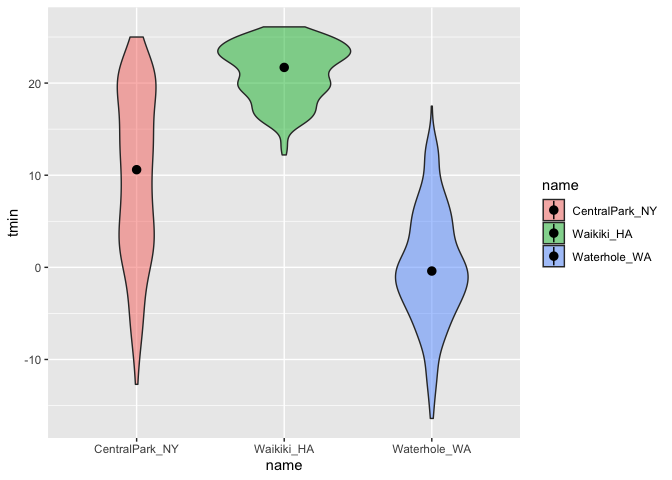<!-- -->

Ridge plot \_ the most popular one in 2017

``` r
weather_df %>% 
  ggplot(aes(x = tmin, y = name)) +
  geom_density_ridges()
```

    ## Picking joint bandwidth of 1.67

    ## Warning: Removed 15 rows containing non-finite values (stat_density_ridges).

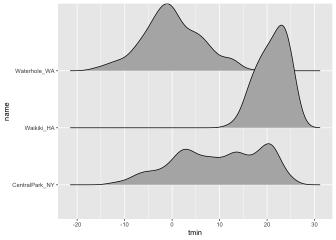<!-- -->

``` r
# more easier to see when we have many categories
# need to load ggridgespackage to run geom_ridges
```

## save and embed

Save a scatterplot

``` r
weather_plot = 
  ggplot(weather_df, aes(x = tmin, y = tmax)) + 
  geom_point(aes(color = name), alpha = .5) 

ggsave("weather_plot.pdf", weather_plot, width = 8, height = 5)
```

    ## Warning: Removed 15 rows containing missing values (geom_point).

``` r
# always put the plot in a object first
# can also give a relative path to save the plot
```

Embeding

``` r
weather_plot
```

    ## Warning: Removed 15 rows containing missing values (geom_point).

<!-- -->

``` r
weather_plot
```

    ## Warning: Removed 15 rows containing missing values (geom_point).

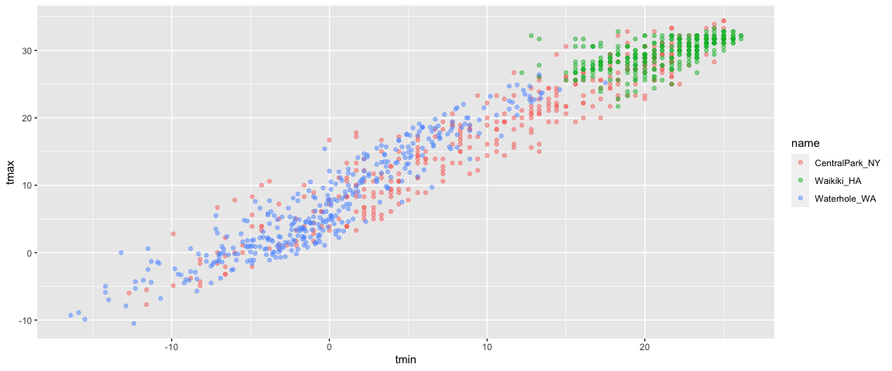<!-- -->
